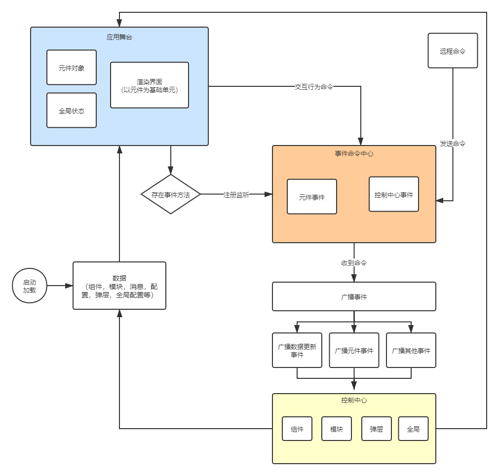

# 框架介绍

## 概述
- 框架基于vue3开发
- 本框架主要应用与数据大屏相关的开发与建设，框架以数据驱动为核心，围绕：**数据、事件与命令、控制与动作、组件、场景**这几个模块搭建。  
- 框架可应用与数据可视化大屏，可视化操作终端，操作演示终端相关业务的开发。

## 术语说明  

- 舞台：所有元件需要显示到页面的对象（displayStage方法上的指定的element）
- 组件：指的是框架内置或用户开发的vue组件
- 元件：指的是组件添加到舞台上后的对象
- 命令：通过cmd.execute执行的字符串值

## 数据驱动流程

