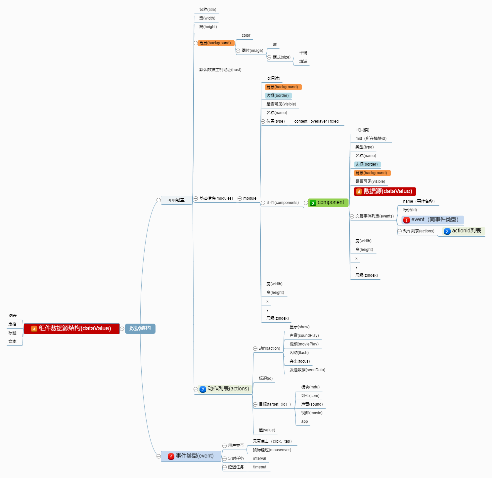

# 数据结构



## 参数说明  

### app配置  
```js
{
   // 应用标题
   title:"",
   // 宽度
   width:1920,
   // 高度
   height:1080,
   // 整体背景样式，根据style样式定义
   background:{
      // 背景颜色
      backgroundColor:'#000000'
   },
   // 所有模块列表，当在模块中添加元件时，没有指定模块id，将自动分配到default模块
   modules:[],
   // 动作列表
   actions:[],
   // 全局动态数据源
   globalData: [],
   // 数据api接口网络有关
   network:{
      // 默认外部数据主机地址
      host:"",
      // 默认模式
      method:"GET",
      // 头部信息
      headers: {}
   }
}
```

### modules模块  
```js
{
   // 模块id，命令控制以id为标识，id可以自定义，但不可重复
   id:"default",
   // 名称
   name:"",
   // 宽度
   width:1920,
   // 高度
   height:1080,
   // 整体背景样式，根据style样式定义
   background:{
      // 背景颜色
      backgroundColor:'#000000'
   },
   // 边框样式，根据style样式定义
   border:{},
   // 是否可见
   visible:true,
   // 模块层级，需要自己控制
   zIndex:1,
   // 类型，模块的类型，通常是所在页面的层级位置。
   // content是主内容区域，
   // fixed是在content上的固定内容区域，
   // overlayer是弹层（此弹层会有一个遮罩蒙版）
   type:"content",
   // 模板内的组件列表
   components:[]
}
```

### component组件(元件)
```js
{
   // 组件标识，自动创建
   id:"Vexlse31",
   // 所在模块id
   mid:"default",
   // 类型，用于对组件归类
   type:"",
   // 名称
   name:"",
   // 宽度
   width:1920,
   // 高度
   height:1080,
   // 整体背景样式，根据style样式定义
   background:{
      // 背景颜色
      backgroundColor:'#000000'
   },
   // 边框样式，根据style样式定义
   border:{},
   // 内边距,根据style的样式定义
   padding:{},
   // 是否可见
   visible:true,
   // 模块层级，需要自己控制
   zIndex:1,
   // 向组件传递的数据
   data:"",
   // 需要绑定的事件列表
   events:[]
}
```
### event事件 
```js
{
   // 事件名称
   name:'点击',
   // 事件类型如click,interval,timeout等
   event:"click",
   // 事件触发的动作列表，存储动作id
   actions:[]
}
``` 


### action动作

```js
{
   // 动作id，自动生成
   id:'act1',
   // 动作
   action:"show",
   // 目标id
   target:"id",
   // 动作值
   value:true
}
```


### globalData全局

```js
{
   // 动作id，自动生成
   id:'act1',
   // 名称
   name:"数据描述",
   // 数据类型source(原始值),remote(远程)
   type:"source",
   // 数据值
   value:""
}
```


### remote远程

```js
{
   // id，自动生成
   id:'RD_xxxx',
   // 远程接口地址
   url:"https://xxxxxxxxxxxxxx",
   // 发送的数据描述
   body:"",
   // 发送方式
   method:"get",
   // 数据提取规则
   extractRule:"",
}
```

#### extractRule格式
需要将数据处理成图表需要的二维数组的数据格式
```js
{
   // 命名
    name:'year',
   // 路径(一般末尾指向的是一个数组)
    path:'data.ued',
   // 需要对照的key（如果数组内是对象，需要单独提取的属性key名称）
    mapKey:'year'
}
```

#### body格式
一个数组
```js
[
   {
      // 发送的字段名
      key:'id',
      // 字段值，可以是原始值，也可以是来自全局数据对象id（GD_xxxxxxx）
      value:'11',
      // 如果value是一个json对象（一般来自全局数据对象），可以通过path路径取具体值
      path:''
   }
]
```


## 示例 
### 数据样例
```js:no-line-numbers
{
   // 标题
   "title": "",
   "width": 1920,
   "height": 1080,
   "background": {},
   "modules": [
   {
      "id": "default",
      "type": "content",
      "x": 0,
      "y": 0,
      "width": 500,
      "height": 500,
      "zIndex": 0,
      "background": {
         "backgroundColor": "#f2f2f2"
      },
      "visible": true,
      "components": [{
         "id": "con01",
         "name": "vx-container",
         "x": 10,
         "y": 10,
         "width": 50,
         "height": 50,
         "zIndex": 0,
         "background": {
            "backgroundColor": "#ffa00030"
         },
         "visible": true,
         "mid": "default",
         "data": "",
         "events": [{
            "name": "点击",
            "event": "click",
            "actions": ['1']
         }]
      }, {
         "id": "con02",
         "name": "vx-container",
         "x": 100,
         "y": 10,
         "width": 50,
         "height": 50,
         "zIndex": 0,
         "background": {
            "backgroundColor": "#16a8f866"
         },
         "visible": true,
         "mid": "default",
         "data": "",
         "events": [{
            "name": "点击",
            "event": "click",
            "actions": ['2', '3']
         }]
      }, {
         "id": "con03",
         "name": "vx-container",
         "x": 180,
         "y": 10,
         "width": 50,
         "height": 50,
         "zIndex": 0,
         "background": {
            "backgroundColor": "#86956866"
         },
         "visible": true,
         "mid": "default",
         "data": "哈哈"
      }]
   }, {
      "id": 'fixed',
      "type": "fixed",
      "visible": true,
      "components": [{
         "id": "con05",
         "name": "vx-box",
         "visible":true,
         "x":300
      }]
   }],
   "actions": [{
      "id": '1',
      "action": "show",
      "target": "con03",
      "value": false
   }, {
      "id": '2',
      "action": "show",
      "target": "con03",
      "value": true
   }, {
      "id": '3',
      "action": "sendData",
      "target": "con03",
      "value": "888"
   }],
   "network":{
      "host": "https://www.xxx.com",
      "method": "GET",
      "headers": {}
   },
   "globalData":[],
   "remote":[]
}
```

### 组件默认混入
```js:no-line-numbers
{
   props: {
      // 添加的舞台id号
      id: {
         type: String,
         default: ""
      },
      // 组件类型
      type: {
         type: String,
         default: "shape"
      },
      // 是否可见
      visible: {
         type: Boolean,
         default: true
      },
      // x坐标位置
      x: {
         type: Number,
         default: 0
      },
      // y坐标位置
      y: {
         type: Number,
         default: 0
      },
      // 默认宽度
      width: {
         type: Number,
         default: 0
      },
      // 默认高度
      height: {
         type: Number,
         default: 0
      },
      // 边框样式
      border: {
         type: Object,
         default () {
            return {}
         }
      },
      // 透明度
      opacity:{
         type:Number,
         default:1
      },
      // 背景样式
      background: {
         type: Object,
         default () {
            return {}
         }
      },
      // 阴影样式
      shadow: {
         type: Object,
         default () {
            return {}
         }
      },
      // z轴深度
      zIndex: {
         type: Number,
         default: 0
      },
      // 事件列队
      events: {
         type: Array,
         default () {
            return []
         }
      },
      // 附加参数
      options: {
         type: Object,
         default () {
            return {}
         }
      },
      // 是否选中（属于辅助参数，值为true时zIndex值提升100000）
      selected:{
         type:Boolean,
         default:false
      },
      // 传入数据
      data: String | Number | Object | Array
   },
   computed: {
      // 计算后的尺寸与位置对象（可用于之后的控制计算）
      rect() {
         return {
            x: this.x,
            y: this.y,
            width: this.width,
            height: this.height
         }
      },
      // 计算后的基础样式
      style() {
         return {
            position: 'absolute',
            width: this.width > 0 ? this.width + 'px' : 'auto',
            height: this.height > 0 ? this.height + 'px' : 'auto',
            top: this.y + 'px',
            left: this.x + 'px',
            zIndex: this.selected ? 100000 + this.zIndex : this.zIndex,
            transform: 'rotate(' + this.angle + 'deg)',
            opacity: this.opacity / 100,
            ...this.border,
            ...this.background,
            ...this.shadow
         }
      }
   }
}
```